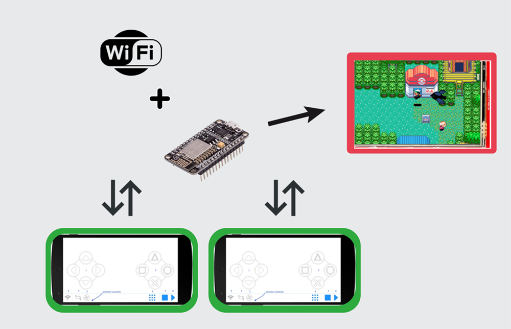

# ESP8266-MultiplayerGame

<!---Esses são exemplos. Veja https://shields.io para outras pessoas ou para personalizar este conjunto de escudos. Você pode querer incluir dependências, status do projeto e informações de licença aqui--->

> Utilizamos o ESP8266 para fazer um game online de forma local. Podendo jogar com até 5 pessoas simultaneamente utlizando um aparelho celular ou desktop, sem restrições.

### Ajustes e melhorias

O projeto ainda está em desenvolvimento e as próximas atualizações serão voltadas nas seguintes tarefas:

- [x] Enviar e receber informações do ESP8266
- [x] Ter conexões simultâneas e fazer se comunicarem
- [x] Desenhar todo o jogo em um Display ISP conectado ao ESP8266
- [ ] Adicionar a opção de poder utlizar o Wifi residencial
- [ ] Fazer com que o jogo também "apareça" no GamePad

## 💻 Pré-requisitos

Antes de começar, verifique se você atendeu aos seguintes requisitos:
<!---Estes são apenas requisitos de exemplo. Adicionar, duplicar ou remover conforme necessário--->
* Você instalou o `Python>=3.9.7`.
* Você tem uma máquina `Windows / Linux / Mac / Android`.

## 🚀 Instalando ESP8266-MultiplayerGame

Para instalar o ESP8266-MultiplayerGame, siga estas etapas:

Instruções:

 - Abrir o aquivo Arduino/Arduino.ino na IDE Arduino.
 - Configurar para poder utlizar o ESP8266 [esp8266 no arduino ide](https://www.robocore.net/tutoriais/programando-o-esp8266-pela-arduino-ide).
 - Instalar o driver do ESP8266 [como instalar o driver](https://www.blogdarobotica.com/2020/05/26/instalando-driver-serial-para-nodemcu-com-chip-ch340/#:~:text=Caso%20a%20placa%20NODEMCU%20ESP8266,NODEMCU%20ESP8266%20n%C3%A3o%20foi%20reconhecida.&text=Ap%C3%B3s%20a%20conclus%C3%A3o%20do%20download,instala%C3%A7%C3%A3o%2C%20conforme%20a%20Figura%205.).
  - Carregar o programa no ESP8266 [como colocar o programa no esp8266](https://seurobo.com.br/como-enviar-o-programa-para-o-arduino-uno-mega-ou-outros/).
  - Compilar o GamePad para a sua máquina [compilar apps com Kivy](https://kivy.org/doc/stable/guide/packaging.html) ou instalar utilizando os links mais abaixo.
  - Agora é só ligar o ESP9266 e entrar no GamePad para se conectar.

Downloads GamePad:
 - `Windows` -> [Download GamePad]()
 - `Mac` -> [Download GamePad]()
 - `Android` -> [Download GamePad]()

## ☕ Jogando ESP8266-MultiplayerGame

Para usar GamePad, siga estas etapas:

 - Se conecte à rede Wifi do ESP8266.
 - Inicialize o App e entre em configurações.
 - Aperte em Host e escolha quantos jogadores vão ser.
 - Agora é só apertar em iniciar e jogar com os seus amigos.

## 📫 Contribuindo para ESP8266-MultiplayerGame
<!---Se o seu README for longo ou se você tiver algum processo ou etapas específicas que deseja que os contribuidores sigam, considere a criação de um arquivo CONTRIBUTING.md separado--->
Para contribuir com ESP8266-MultiplayerGame, siga estas etapas:

1. Bifurque este repositório.
2. Crie um branch: `git checkout -b dev`.
3. Faça suas alterações e confirme-as: `git commit -m '<mensagem_commit>'`
4. Envie para o branch: `git push origin dev`
5. Crie a solicitação de pull.

Como alternativa, consulte a documentação do GitHub em [como criar uma solicitação pull](https://help.github.com/en/github/collaborating-with-issues-and-pull-requests/creating-a-pull-request).

## 🤝 Colaboradores

Agradecemos às seguintes pessoas que contribuíram para este projeto:

<table>
  <tr>
    <td align="center">
      <a href="#">
         
        
          <b>Heitor Tasso</b>
        
      </a>
    </td>
    <td align="center">
      <a href="#">
         
        
          <b>Mark Zuckerberg</b>
        
      </a>
    </td>
    <td align="center">
      <a href="#">
         
        
          <b>Steve Jobs</b>
        
      </a>
    </td>
  </tr>
</table>

## 📝 Licença

Esse projeto está sob licença. Veja o arquivo [LICENÇA](LICENSE.md) para mais detalhes.

[⬆ Voltar ao topo](#ESP8266-MultiplayerGame) 
